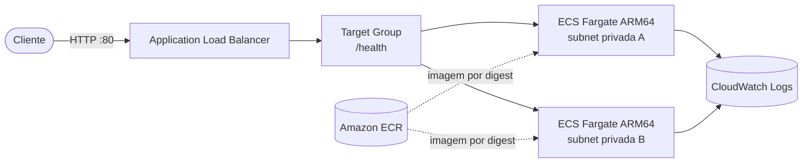

# AWS Fargate Infrastructure Lab (FargateFlow)

[](https://github.com/kaiotcp1/ECS/actions/workflows/ci.yml)
[](https://github.com/kaiotcp1/ECS/actions/workflows/terraform.yml)
[](https://github.com/kaiotcp1/ECS/actions/workflows/deploy.yml)


API minima em Node.js, TypeScript e Fastify usada para estudar uma implantacao real
em Amazon ECS com AWS Fargate. A infraestrutura da aplicacao e declarada em Terraform;
o GitHub Actions valida o codigo, publica uma imagem ARM64 imutavel no ECR e atualiza o
servico ECS.

## Arquitetura

O trafego entra por um Application Load Balancer publico e chega a tarefas Fargate
ARM64 executadas sem IP publico em duas zonas de disponibilidade. Imagens imutaveis
ficam no ECR, logs estruturados seguem para o CloudWatch e o GitHub Actions acessa a
AWS por OIDC, sem access keys permanentes.



### Documentacao por escopo

- [Visao geral da documentacao](docs/README.md)
- [Arquitetura cloud e diagramas](docs/architecture.md)
- [Aplicacao e container](docs/application.md)
- [Infraestrutura Terraform](docs/infrastructure.md)
- [Pipelines CI/CD](docs/ci-cd.md)
- [Operacao, seguranca e custos](docs/operations.md)

O bucket de state e o provedor OIDC sao compartilhados pela conta. Eles nao pertencem
ao state do FargateFlow e, portanto, nao sao removidos por `terraform destroy`.

## Desenvolvimento local

Requisitos: Node.js 24 e npm.

```powershell
npm ci
npm run dev
```

Validacao completa:

```powershell
npm run format:check
npm run lint
npm test
npm run build
```

Endpoints:

```text
GET /
GET /health
```

## Backend Terraform compartilhado

O bucket abaixo foi criado uma unica vez pela AWS CLI e pode armazenar states de
outros projetos. Cada projeto deve usar uma chave diferente no bloco `backend "s3"`.

```text
Bucket: terraform-states-761018861028-us-east-1
FargateFlow: fargateflow/study/terraform.tfstate
Outro projeto: nome-do-projeto/ambiente/terraform.tfstate
```

Criacao reproduzivel em `us-east-1`:

```powershell
$bucket = "terraform-states-761018861028-us-east-1"

aws s3api create-bucket --bucket $bucket --region us-east-1
aws s3api put-public-access-block --bucket $bucket --public-access-block-configuration "BlockPublicAcls=true,IgnorePublicAcls=true,BlockPublicPolicy=true,RestrictPublicBuckets=true"
aws s3api put-bucket-versioning --bucket $bucket --versioning-configuration Status=Enabled
aws s3api put-bucket-encryption --bucket $bucket --server-side-encryption-configuration "Rules=[{ApplyServerSideEncryptionByDefault={SSEAlgorithm=AES256}}]"
aws s3api put-bucket-ownership-controls --bucket $bucket --ownership-controls "Rules=[{ObjectOwnership=BucketOwnerEnforced}]"
aws s3api put-bucket-tagging --bucket $bucket --tagging "TagSet=[{Key=Name,Value=terraform-states},{Key=Purpose,Value=terraform-states},{Key=ManagedBy,Value=cli},{Key=Owner,Value=kaio}]"
aws s3api put-bucket-policy --bucket $bucket --policy file://docs/terraform-state-bucket-policy.json
```

O S3 aplica criptografia SSE-S3 automaticamente a novos objetos. A configuracao foi
tambem fixada explicitamente como AES-256. Nao usamos uma chave KMS propria para evitar
o custo mensal da chave. O arquivo de policy exige transporte HTTPS.

Validacao do backend:

```powershell
aws s3api get-public-access-block --bucket $bucket
aws s3api get-bucket-versioning --bucket $bucket
aws s3api get-bucket-encryption --bucket $bucket
aws s3api get-bucket-policy-status --bucket $bucket
```

## Terraform

Requisitos: Terraform 1.15, AWS CLI autenticada na conta correta e Docker para o CD.

```powershell
cd infra
terraform init
terraform fmt -check -recursive
terraform validate
terraform plan -var-file=environments/study.tfvars
terraform apply -var-file=environments/study.tfvars
```

O primeiro `apply` cria o servico ECS com zero tarefas, pois o ECR ainda pode estar
vazio. Depois disso, o workflow `CD`:

1. constroi e publica a imagem ARM64;
2. bloqueia o deploy se o scan encontrar vulnerabilidades HIGH ou CRITICAL;
3. registra uma task definition apontando para o digest imutavel;
4. escala o servico para duas tarefas;
5. aguarda estabilidade e testa `GET /health` pelo ALB.

Alteracoes de `desired_count` e `task_definition` feitas pelo CD sao ignoradas pelo
Terraform para evitar disputa de ownership entre as duas ferramentas.

### Provisionamento automatico com trava de custo

O arquivo `infra/environments/study.tfvars` controla os gates de ciclo de vida da
pipeline:

```hcl
provision_infrastructure = false
destroy_infrastructure = false
```

Com `false`, todo push na `main` executa CI, valida Terraform e cria um plan, mas
nunca executa `terraform apply`. Altere para `true`, versione e envie o arquivo para
liberar o apply automatico depois de todas as validacoes. Retorne a chave para `false`
antes de novos pushes que nao devam recriar o laboratorio.

Com `destroy_infrastructure=true`, o workflow encadeado `Destroy runtime` cria um
plano `-destroy` e remove somente os recursos do state `fargateflow/study`. As duas
chaves nao podem ser `true` ao mesmo tempo. Retorne a chave de destroy para `false`
no commit seguinte.

As chaves controlam a pipeline, nao os recursos Terraform. Assim, mudar para `false`
nunca gera um plano de destruicao acidental.

## Custos e remocao

NAT Gateway, enderecos IPv4 publicos, Application Load Balancer e tarefas Fargate
geram cobranca enquanto existem. Ao terminar o laboratorio:

```powershell
cd infra
terraform plan -destroy -var-file=environments/study.tfvars
terraform destroy -var-file=environments/study.tfvars
```

Confirme que nao sobraram recursos do projeto:

```powershell
aws ec2 describe-nat-gateways --filter Name=tag:Project,Values=aws-fargate-infrastructure-lab Name=state,Values=pending,available,deleting
aws ec2 describe-addresses --filters Name=tag:Project,Values=aws-fargate-infrastructure-lab
aws elbv2 describe-load-balancers --query "LoadBalancers[?starts_with(LoadBalancerName, 'fargateflow')]"
aws ecs describe-services --cluster fargateflow-cluster --services fargateflow-service
aws ecr describe-repositories --repository-names fargateflow
```

O state S3, o provedor GitHub OIDC e a role compartilhada do GitHub Actions permanecem
para os proximos projetos. Um bucket vazio nao tem custo de armazenamento; os pequenos
arquivos de state armazenados geram apenas custo proporcional de S3.

## Identidade de CI/CD

A role compartilhada `github-actions-deploy-role` e assumida via OIDC por todos os
workflows: Terraform, destroy e CD. Ela usa credenciais temporarias e uma trust policy
que aceita repositorios da conta GitHub e as branches `main`, `develop` e `homolog`.
Essa simplicidade e apropriada para o laboratorio e para projetos pessoais; em uma
organizacao maior, convem separar permissao por repositorio e ambiente.
