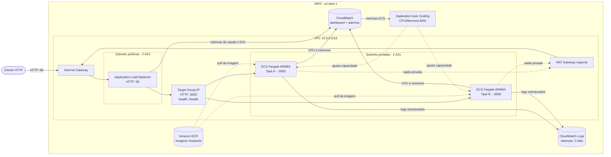
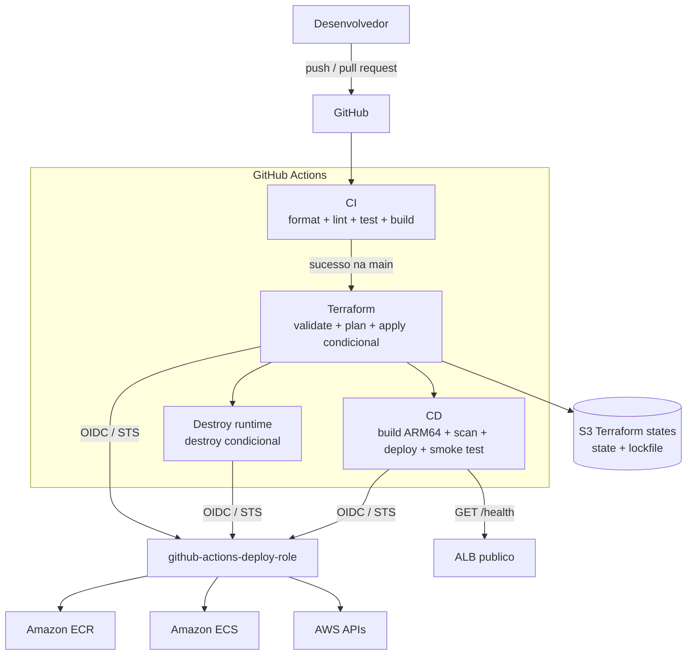

# Arquitetura cloud

O FargateFlow demonstra uma API pequena operando em uma arquitetura AWS proxima de
um workload real: entrada publica controlada por um Application Load Balancer,
containers sem IP publico em duas zonas de disponibilidade e entrega automatizada
com credenciais temporarias.

## Visao geral

O ALB e o unico ponto de entrada publico. As tarefas recebem interfaces de rede nas
subnets privadas, nao recebem IP publico e aceitam a porta `3000` somente quando a
origem e o security group do ALB.

## Plano de entrega e controle

Nao existem access keys permanentes no GitHub. Cada execucao troca o token OIDC do
GitHub por credenciais AWS temporarias via `sts:AssumeRoleWithWebIdentity`.

## Fluxo de uma requisicao

1. O cliente resolve o DNS publico do ALB e envia uma requisicao HTTP na porta `80`.
2. O listener encaminha a requisicao ao target group `fargateflow-tg`.
3. O target group seleciona uma tarefa saudavel e envia trafego para a porta `3000`.
4. O Fastify responde e registra a requisicao em JSON no stdout do container.
5. O driver `awslogs` entrega o log ao grupo `/ecs/fargateflow` no CloudWatch.

O target group chama `GET /health` a cada 30 segundos. Uma tarefa so recebe trafego
quando passa pelos health checks do container, do ECS e do load balancer.

## Limites de rede

| Origem      | Destino           | Regra                                                     |
| ----------- | ----------------- | --------------------------------------------------------- |
| Internet    | ALB               | TCP `80` permitido                                        |
| ALB         | Tarefas ECS       | TCP `3000`, limitado por referencia entre security groups |
| Internet    | Tarefas ECS       | Sem rota de entrada e sem regra permitida                 |
| Tarefas ECS | Servicos externos | Saida pelo NAT Gateway regional                           |

## Decisoes principais

- **Duas AZs:** ALB e tarefas podem operar em mais de uma zona de disponibilidade.
- **Fargate ARM64:** executa a imagem `linux/arm64` em AWS Graviton, sem administrar EC2.
- **Imagem por digest:** o ECS recebe o digest SHA-256, eliminando ambiguidade de tags.
- **Subnets privadas:** tarefas nao ficam diretamente expostas a Internet.
- **NAT regional:** simplifica a saida multi-AZ do laboratorio, mas e um recurso pago.
- **HTTP intencional:** HTTPS e dominio ficaram fora do escopo atual do laboratorio.
- **Infraestrutura efemera:** `terraform destroy` remove o runtime quando o estudo termina.
- **Gates de ciclo de vida:** flags versionadas autorizam `apply` ou `destroy`, nunca os
  dois na mesma execucao.
- **Recuperacao automatica:** o ECS interrompe e faz rollback de deployments que nao
  estabilizam ou que sustentam erros `5XX` nos targets do ALB.
- **Observabilidade proporcional:** um dashboard CloudWatch concentra saude dos targets,
  erros `5XX`, CPU e memoria sem habilitar Container Insights.
- **Escalabilidade preparada:** Application Auto Scaling monitora CPU e memoria com alvo
  de 80%, entre zero e quatro tarefas, pronto para um futuro teste de carga.
