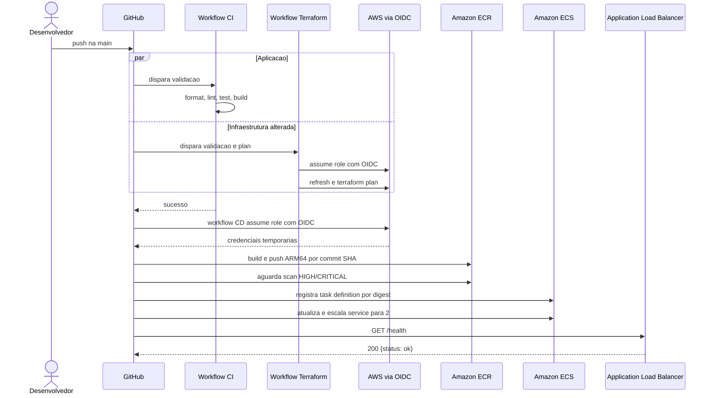

# CI/CD

Tres workflows separam qualidade de codigo, validacao de infraestrutura e entrega.
Actions de terceiros sensiveis estao fixadas por commit SHA para reduzir risco de
alteracao inesperada de dependencias da pipeline.

## Fluxo completo

## CI

Executa em pushes e pull requests direcionados a `main`:

1. instala Node.js 24 e dependencias com `npm ci`;
2. verifica formatacao com Prettier;
3. executa ESLint;
4. executa testes Vitest;
5. compila TypeScript.

Uma falha impede o acionamento automatico do CD.

## Terraform

Em pull requests, executa `fmt`, inicializacao sem backend e `validate`, sem acessar a
conta AWS. Em pushes na `main` que alteram os caminhos monitorados, tambem assume a
role AWS por OIDC, inicializa o backend S3 e gera um `terraform plan`.

O workflow nao executa `terraform apply` nem `terraform destroy`. Essa separacao torna
mudancas de infraestrutura visiveis antes de qualquer criacao com custo.

## CD

O CD inicia depois de um CI bem-sucedido na `main` ou por acionamento manual na mesma
branch. Primeiro confirma que ECR e service ECS existem; se a stack estiver destruida,
finaliza com sucesso e registra que o deploy foi ignorado.

Quando a infraestrutura existe:

1. autentica na AWS e no ECR com credenciais temporarias;
2. reutiliza a imagem se o SHA do commit ja estiver publicado;
3. gera uma imagem `linux/arm64` com cache do GitHub Actions;
4. bloqueia a entrega se o scan ECR encontrar severidade `HIGH` ou `CRITICAL`;
5. resolve o digest imutavel da imagem;
6. registra e implanta uma nova task definition;
7. aguarda estabilidade e escala o service para duas tarefas;
8. valida `GET /health` pelo DNS publico do ALB;
9. escreve commit, imagem, task definition, service e resultado no job summary.

O upload do build record `.dockerbuild` esta desabilitado. A pipeline mantem apenas o
resumo legivel do build e do deploy.

## Identidade

Os workflows solicitam `id-token: write` somente nos jobs que acessam a AWS. A role
`github-actions-deploy-role` valida o contexto OIDC permitido e fornece credenciais
temporarias. O account ID e mascarado pelas actions; nomes de recursos, commit SHA e
digests exibidos no summary sao metadados operacionais, nao segredos.
